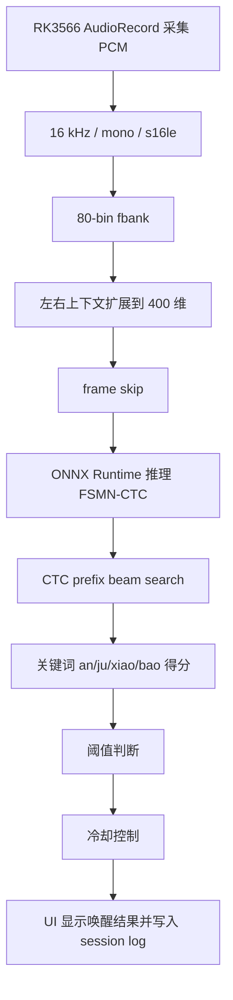

# 安居小宝 WeKWS 当前项目架构

更新时间：2026-05-13

本文只描述当前保留版本。历史训练轮次、旧部署包、旧字典、旧 prepared/eval 数据已经移动到：

`E:\CodeWorking\Project\AnJuXiaoBaoKWS\_archive\superseded_20260513`

## 1. 当前目标

在 RK3566 Android 端运行基于 WeKWS FSMN-CTC 的本地语音唤醒程序，唤醒词为“安居小宝”。

当前项目保留的是 WeKWS 路线，不再混入 prototype DS-CNN 路线资产。

## 2. 当前主目录结构

```text
E:\CodeWorking\Project\AnJuXiaoBaoKWS
├─ configs                         # 训练/导出配置模板
├─ data
│  ├─ prepared_pretrain_posbalanced_mid_20260509
│  │                                  # 当前训练与评估清单
│  ├─ raw                            # 原始项目内数据入口
│  ├─ rk3566_live_capture_debug       # RK3566 App 抓取的监听日志和录音
│  └─ templates                       # 数据处理模板
├─ deploy
│  └─ rk3566_wekws_model_mid_20260509 # 当前 RK3566 部署包
├─ dict
│  └─ pretrain_posbalanced_mid_20260509
├─ docs
│  └─ CURRENT_PROJECT_ARCHITECTURE_20260513.md
├─ experiments
│  └─ pretrain_posbalanced_mid_20260509_001
├─ scripts                           # 项目脚本
├─ src                               # 项目侧 Python 数据/训练辅助代码
├─ third_party
│  └─ wekws
│     └─ runtime\android             # 当前 Android 端工程
├─ tools                             # 工具脚本
└─ _archive
   └─ superseded_20260513            # 旧版本归档
```

## 3. 当前模型版本

当前实验目录：

`E:\CodeWorking\Project\AnJuXiaoBaoKWS\experiments\pretrain_posbalanced_mid_20260509_001`

当前部署使用 checkpoint：

`E:\CodeWorking\Project\AnJuXiaoBaoKWS\experiments\pretrain_posbalanced_mid_20260509_001\5.pt`

当前部署 ONNX：

`E:\CodeWorking\Project\AnJuXiaoBaoKWS\deploy\rk3566_wekws_model_mid_20260509\kws.onnx`

当前部署配置：

`E:\CodeWorking\Project\AnJuXiaoBaoKWS\deploy\rk3566_wekws_model_mid_20260509\kws_runtime_config.json`

当前字典：

`E:\CodeWorking\Project\AnJuXiaoBaoKWS\dict\pretrain_posbalanced_mid_20260509`

## 4. 当前训练数据入口

项目内当前 prepared 数据：

`E:\CodeWorking\Project\AnJuXiaoBaoKWS\data\prepared_pretrain_posbalanced_mid_20260509`

该目录中的清单仍引用外部总数据目录：

`E:\CodeWorking\Dataset`

因此外部 Dataset 目录本次没有移动，避免破坏现有训练清单中的绝对路径。

当前训练数据的主要来源包括：

- AISHELL3 218 音源生成的“安居小宝”TTS 正样本
- 带 RK3566 真实底噪混合的 TTS 正样本
- 带 RK3566 真实底噪混合的 TTS 负样本
- hard negative 近音/近似负样本
- 一部分 RK3566 真实正样本参与训练
- 留出的真实正样本用于验证
- 连续录音误触发窗口反挖得到的 hard negative

## 5. 当前部署包

部署包目录：

`E:\CodeWorking\Project\AnJuXiaoBaoKWS\deploy\rk3566_wekws_model_mid_20260509`

包含：

```text
config.yaml
dict.txt
kws.onnx
kws_runtime_config.json
words.txt
```

Android assets 当前保留：

```text
third_party\wekws\runtime\android\app\src\main\assets\kws.onnx
third_party\wekws\runtime\android\app\src\main\assets\kws_runtime_config.json
```

旧 prototype 路线遗留的 `prototype.txt` 已经从 Android assets 移到归档目录。

## 6. Android 端工程

Android 工程路径：

`E:\CodeWorking\Project\AnJuXiaoBaoKWS\third_party\wekws\runtime\android`

关键文件：

```text
app\src\main\cpp\wekws.cc
app\src\main\java\cn\org\wenet\wekws\MainActivity.java
app\src\main\assets\kws.onnx
app\src\main\assets\kws_runtime_config.json
```

当前 APK：

`E:\CodeWorking\Project\AnJuXiaoBaoKWS\third_party\wekws\runtime\android\app\build\outputs\apk\debug\app-debug.apk`

板端包名：

`cn.org.wenet.wekws`

板端日志目录：

`/sdcard/Android/data/cn.org.wenet.wekws/files/logs/`

板端录音抓取目录：

`/sdcard/Android/data/cn.org.wenet.wekws/files/captures/`

## 7. 当前实时检测链路



当前 Android native 侧已经按官方 `stream_kws_ctc.py` 的思路调整过 CTC prefix beam search，并增加了语音起点 reset 逻辑。

核心参数位置：

`E:\CodeWorking\Project\AnJuXiaoBaoKWS\third_party\wekws\runtime\android\app\src\main\cpp\wekws.cc`

重点参数：

```text
kScoreBeamSize = 3
kPathBeamSize = 20
kScorePruneThreshold = 0.05
kSilenceChunksBeforeReset = 20
```

## 8. 最近一次板端验证

最近一次拉取的 App 监听 session：

`E:\CodeWorking\Project\AnJuXiaoBaoKWS\data\rk3566_live_capture_debug\app_sessions\listen_session_20260512_100442.log`

同 session 录音：

`E:\CodeWorking\Project\AnJuXiaoBaoKWS\data\rk3566_live_capture_debug\app_sessions\listen_session_20260512_100442_16k_s16le.wav`

该 session 约 76.88 秒，记录到 8 次唤醒。推理延迟多数在 9 到 13 ms 附近。

当前效果相比之前“启动后几秒 score 变 0”的问题已经明显改善，但后续仍建议继续调：

- 适当提高 `kSilenceChunksBeforeReset` 到 30 到 40
- 增加 reset cooldown
- 要求连续 2 到 3 个 speech chunk 后再触发 speech-onset reset
- 对真实办公室连续录音做更完整的误唤醒评估

## 9. 当前版本边界

当前主目录只保留一个可继续迭代的版本：

- 当前训练实验：`pretrain_posbalanced_mid_20260509_001`
- 当前 prepared 数据：`prepared_pretrain_posbalanced_mid_20260509`
- 当前字典：`pretrain_posbalanced_mid_20260509`
- 当前部署包：`rk3566_wekws_model_mid_20260509`
- 当前 Android runtime：`third_party\wekws\runtime\android`

旧版本没有删除，统一归档在 `_archive\superseded_20260513`。如果后续确认不再需要，可以再单独清理归档目录。
